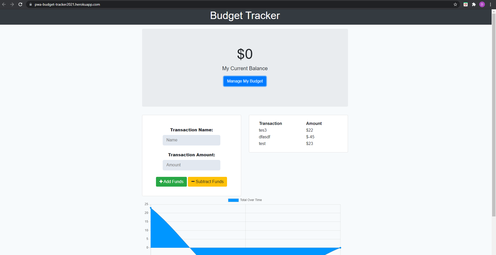

# progressive-Budget

    
    
    
    

  

    
    
    
    

## Description 

Having the ability to access and input information from an application while offline is paramount to having the application accessible to all users, anytime and anywhere. With this refactored PWA (Progressive Web App) for Budget Expenses, users are able to add and subtract funds whether they are connected to the internet or not. Once a new internet connection is established, whatever the user input will automatically be added to their transaction history. This is achieved through using indexedDB, mongoose, and MongoDB.

## Table of Contents 📖

- [Technologies Used](#technologies-used-%EF%B8%8F)
- [Installation](#installation-%EF%B8%8F)
- [Usage Demo](#usage-demo)
- [License](#license-)

## Technologies Used 🖥️

| Technology  | Link                                    |
| ----------- | --------------------------------------- |
| MongoDB     | https://www.mongodb.com/                |
| Express     | https://expressjs.com/                  |
| Mongoose    | https://mongoosejs.com/docs/            |

## Installation ⚙️

1. Download a copy of this repository
2. Make sure you have Node.js and npm installed
    - Install necessary npm packages via `npm install`
3. Navigate to the file location of the downloaded repository using the command line
5. Enter `npm start` to start the server and open `http://localhost:3000/` to interact with the application.

## Usage Demo

[Deployed Application](https://pwa-budget-tracker2021.herokuapp.com/)

Screenshot:

## License 

MIT
